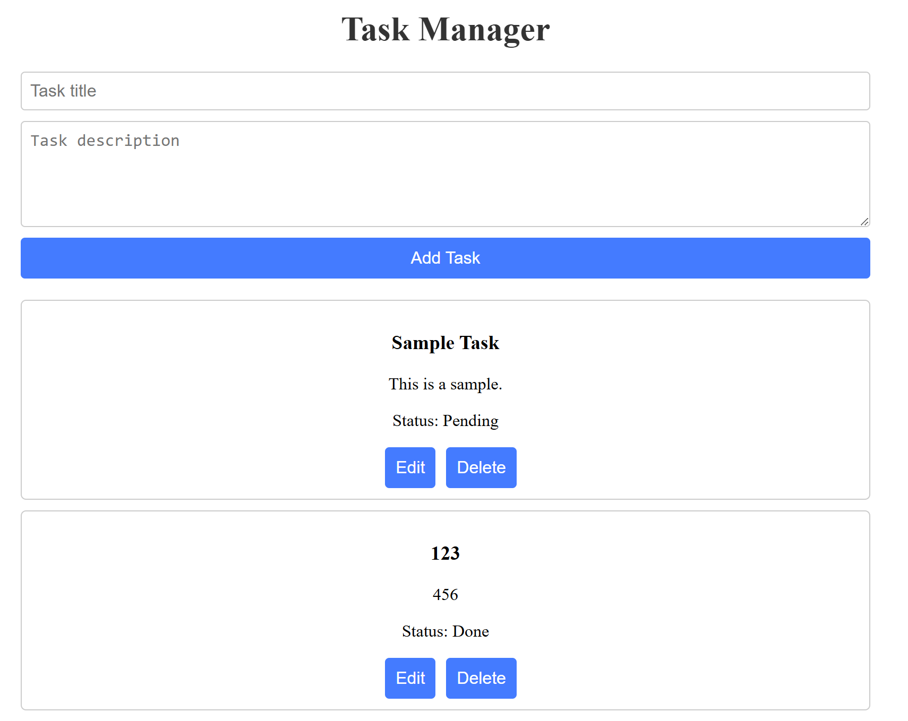

# Task Manager FastAPI-React Demo

A simple REST API built with FastAPI backend to manage tasks. This project demonstrates integration with ReactJS frontend.

## Directory

   ```
   project/
   ├── backend/
   │   ├── main.py
   │   └── models.py
   └── frontend/
       ├── public/
       │   ├── index.html
       │   ├── manifest.json  (optional, auto-generated by Create React App)
       │   └── favicon.ico   (optional)
       ├── src/
       │   ├── App.js
       │   ├── App.css
       │   ├── components/
       │   │   ├── TaskForm.js
       │   │   └── TaskList.js
       │   └── index.js      
       └── package.json
   ```

## Features
- CRUD operations for tasks (Create, Read, Update, Delete)
- In-memory data store
- FastAPI: asynchronous and fast execution
- ReactJS: server-side rendering allows React components to be rendered on the server and sent to the browser as fully rendered HTML

## Setup
1. Clone the repository:
   ```bash
   git clone https://github.com/pjlau/crud-fastapi-demo.git
   cd crud-fastapi-demo
2. Install backend dependencies:
   ```bash
   pip install fastapi uvicorn pydantic
3. Run the Web App:
   ```bash
   uvicorn main:app --reload --port 8000
4. Install frontend dependencies:
   ```bash
   cd frontend
   npm install
5. Start the React development server:
   ```bash
   npm start
6. Access the web app at `http://localhost:3000/`.

## Functionality
The app provides the CRUD operations:

- GET /tasks: List all tasks.

- GET /tasks/{id}: Retrieve a specific task.

- POST /tasks: Create a new task with title and optional description.

- PUT /tasks/{id}: Update a task’s title, description, or done status.

- DELETE /tasks/{id}: Delete a task.

## Results


